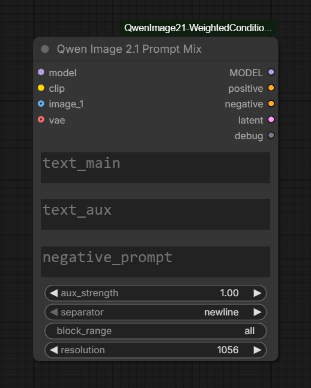

# ComfyUI Qwen Image 2.1 Weighted Conditioning

**Qwen Image 2.1 Prompt Mix** keeps a subject or edit instruction at full strength while independently scaling a second style or moodboard prompt.

Qwen does not use CLIP-style `(prompt:0.5)` weighting. This node encodes both prompts as one Qwen sequence, identifies the auxiliary tokens, and scales only their value vectors inside the diffusion model's self-attention.

## Node

| | |
|---|---|
| **Name** | Qwen Image 2.1 Prompt Mix |
| **Category** | `model/conditioning/qwen image` |
| **Outputs** | `MODEL`, positive, negative, latent, debug |
| **Dependencies** | Current ComfyUI with native Qwen Image 2.1 support |

<p align="center">
  
</p>

### Wiring

```text
Qwen Image 2.1 MODEL ──────────────► model       MODEL ─────► sampler.model
Qwen Image 2.1 CLIP ───────────────► clip     positive ─────► sampler.positive
Load Image(s), optional ────────────► image_*  negative ─────► sampler.negative
Qwen Image 2.1 VAE, for editing ───► vae        latent ─────► sampler.latent_image

Subject or edit instruction ───────► text_main
Style or moodboard prompt ─────────► text_aux
Negative prompt ───────────────────► negative_prompt
```

For text-to-image generation, leave `image_*` and `vae` disconnected. For image editing, connect one or more reference images and the Qwen Image 2.1 VAE.

## Install

Place this repository in `ComfyUI/custom_nodes`, then restart ComfyUI. No additional Python packages are required.

## Usage

1. Connect the Qwen Image 2.1 model and CLIP.
2. Enter the subject or edit instruction in `text_main`.
3. Enter style or moodboard text in `text_aux`.
4. Start with `aux_strength` around `0.45`.
5. Connect the model, positive, negative, and latent outputs to the sampling workflow.

Do not concatenate a second encoded conditioning for the auxiliary prompt. Prompt Mix already produces one correctly templated Qwen sequence.

## Controls

| Input | Behavior |
|---|---|
| `aux_strength` | `0.0` omits auxiliary text, `1.0` is unweighted, and other values scale auxiliary tokens |
| `separator` | Joins the main and auxiliary text with a newline, space, or comma |
| `block_range` | Applies weighting to all blocks or a selection such as `0-20` or `4,8,12` |
| `negative_prompt` | Encoded normally and never receives auxiliary weighting |
| `resolution` | Controls reference-image preparation using native Qwen Image 2.1 sizing |
| `images` | Autogrowing reference-image inputs |
| `vae` | Adds reference latents for image editing when connected |

Reference images, alpha handling, vision encoding, reference latents, and empty-latent sizing follow ComfyUI's native Qwen Image 2.1 behavior.

## Notes

- Weighting applies only to positive CFG rows.
- `aux_strength=0.0`, an empty auxiliary prompt, and `aux_strength=1.0` avoid the model patch.
- Active weighting disables Qwen Image 2.1 prefix KV caching and may make reference-image sampling slower.
- The extension intentionally uses value scaling only. Key-bias weighting is not compatible with the current Qwen Image 2.1 block-causal attention hook.

## License

Apache License 2.0.

[Krea 2 Weighted Conditioning](https://github.com/cicalooo/ComfyUI-Krea2-WeightedConditioning)
